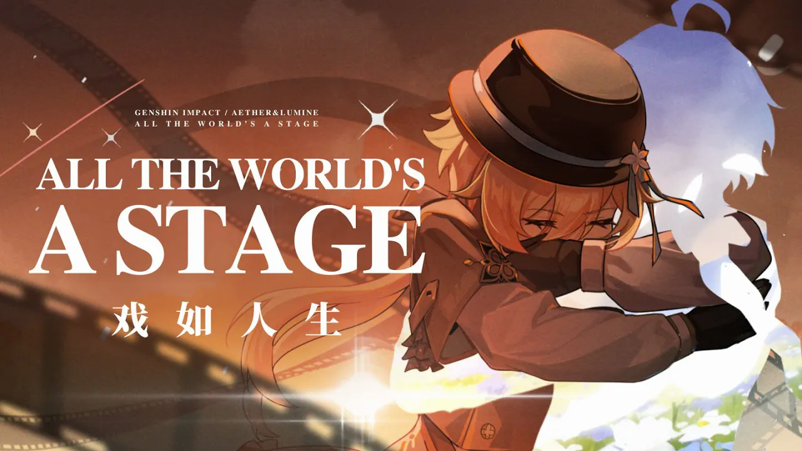

「戲如人生。」
——威廉·莎士比亞，《皆大歡喜》第二幕第七景

若吾目所及，唯無盡鋪展之影卷——
「人間八苦，豈命運偶成之悲劇，抑眾生甘願粉墨之演乎？」

吾等持傳聲之器，負攝影之機，徜徉諸世舞台，
錄魂靈掙扎狂歡於無窮時序。

影卷旋而世局易，吾輩恆並肩。
無論鏡中鏡外，吾——雙生——從未言「終」。

“𝐴𝑙𝑙 𝑡ℎ𝑒 𝑤𝑜𝑟𝑙𝑑’𝑠 𝑎 𝑠𝑡𝑎𝑔𝑒.”
— 𝐖𝐢𝐥𝐥𝐢𝐚𝐦 𝐒𝐡𝐚𝐤𝐞𝐬𝐩𝐞𝐚𝐫𝐞, 𝐀𝐬 𝐘𝐨𝐮 𝐋𝐢𝐤𝐞 𝐈𝐭, 𝐀𝐜𝐭 𝐈𝐈, 𝐒𝐜𝐞𝐧𝐞 𝐕𝐈𝐈

𝐈𝐟 𝐚𝐥𝐥 𝐰𝐞 𝐬𝐞𝐞 𝐢𝐬 𝐛𝐮𝐭 𝐚𝐧 𝐞𝐧𝐝𝐥𝐞𝐬𝐬𝐥𝐲 𝐮𝐧𝐟𝐨𝐥𝐝𝐢𝐧𝐠 𝐟𝐢𝐥𝐦—
“𝐴𝑟𝑒 𝑡ℎ𝑒 𝐸𝑖𝑔ℎ𝑡 𝑆𝑢𝑓𝑓𝑒𝑟𝑖𝑛𝑔𝑠 𝑜𝑓 𝑡ℎ𝑒 𝑚𝑜𝑟𝑡𝑎𝑙 𝑤𝑜𝑟𝑙𝑑 𝑎 𝑡𝑟𝑎𝑔𝑒𝑑𝑦 𝑖𝑚𝑝𝑟𝑜𝑣𝑖𝑠𝑒𝑑 𝑏𝑦 𝑓𝑎𝑡𝑒,
𝑜𝑟 𝑎 𝑝𝑒𝑟𝑓𝑜𝑟𝑚𝑎𝑛𝑐𝑒 𝑖𝑛 𝑤ℎ𝑖𝑐ℎ 𝑎𝑙𝑙 𝑠𝑜𝑢𝑙𝑠 𝑤𝑖𝑙𝑙𝑖𝑛𝑔𝑙𝑦 𝑝𝑙𝑎𝑦 𝑡ℎ𝑒𝑖𝑟 𝑝𝑎𝑟𝑡?”

𝐖𝐞 𝐰𝐚𝐧𝐝𝐞𝐫 𝐚𝐜𝐫𝐨𝐬𝐬 𝐭𝐡𝐞 𝐬𝐭𝐚𝐠𝐞𝐬,  
𝐦𝐞𝐠𝐚𝐩𝐡𝐨𝐧𝐞𝐬 𝐢𝐧 𝐡𝐚𝐧𝐝, 𝐜𝐚𝐦𝐞𝐫𝐚𝐬 𝐨𝐧 𝐨𝐮𝐫 𝐬𝐡𝐨𝐮𝐥𝐝𝐞𝐫𝐬,  
𝐜𝐚𝐩𝐭𝐮𝐫𝐢𝐧𝐠 𝐭𝐡𝐞 𝐬𝐭𝐫𝐮𝐠𝐠𝐥𝐞𝐬 𝐚𝐧𝐝 𝐫𝐞𝐯𝐞𝐥𝐫𝐲 𝐨𝐟 𝐬𝐨𝐮𝐥𝐬 𝐚𝐜𝐫𝐨𝐬𝐬 𝐜𝐨𝐮𝐧𝐭𝐥𝐞𝐬𝐬 𝐭𝐢𝐦𝐞𝐥𝐢𝐧𝐞𝐬.

𝐀𝐬 𝐭𝐡𝐞 𝐫𝐞𝐞𝐥𝐬 𝐬𝐩𝐢𝐧 𝐚𝐧𝐝 𝐭𝐡𝐞 𝐰𝐨𝐫𝐥𝐝𝐬 𝐬𝐡𝐢𝐟𝐭,  
𝐰𝐞 𝐫𝐞𝐦𝐚𝐢𝐧 𝐬𝐢𝐝𝐞 𝐛𝐲 𝐬𝐢𝐝𝐞.  
𝐖𝐢𝐭𝐡𝐢𝐧 𝐭𝐡𝐞 𝐟𝐫𝐚𝐦𝐞 𝐨𝐫 𝐛𝐞𝐲𝐨𝐧𝐝 𝐢𝐭, 𝐰𝐞—𝐭𝐡𝐞 𝐓𝐰𝐢𝐧𝐬—𝐧𝐞𝐯𝐞𝐫 𝐜𝐚𝐥𝐥 𝐢𝐭 𝐚 𝐰𝐫𝐚𝐩.



    <iframe src="https://www.youtube.com/embed/ufMGRxFIzO4" title="YouTube video player" frameborder="0" allow="accelerometer; autoplay; clipboard-write; encrypted-media; gyroscope; picture-in-picture; web-share" allowfullscreen style="position: absolute; top: 0; left: 0; width: 100%; height: 100%;"></iframe>



<video src="video.mkv" controls></video>